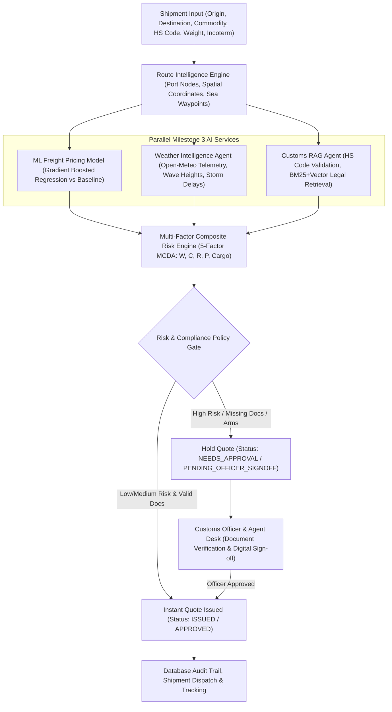

# ⚓ FreightAI: Intelligent Freight Quote Generation System
### *AI-Driven Logistics Intelligence, Marine Weather Telemetry, Customs RAG Compliance & Machine Learning Freight Pricing*

[](https://freight-quote-generation-system-grp.vercel.app/)
[](https://www.python.org/)
[](https://www.djangoproject.com/)
[](https://react.dev/)
[](https://vitejs.dev/)
[-464646?style=for-the-badge&logo=pytest&logoColor=white)](#-empirical-testing--verification)

---

## 📌 Executive Summary & Project Vision

**FreightAI** transforms traditional freight forwarding from isolated, manual cost estimation into an **Autonomous Intelligence & Regulatory Compliance Orchestrator**. 

The platform connects **Shippers (Retail & Business)**, **Logistics Agents**, and **Customs/Admin Officers** in a single real-time ecosystem where quotes are automatically evaluated against **Live Marine Weather Telemetry**, **Customs Regulations (via Hybrid BM25+Vector RAG)**, **Multi-Factor Composite Risk Policy Gating**, and **Gradient-Boosted Machine Learning Freight Rate Predictions** before final quote issuance.

---

## 🗺️ System Architecture & End-to-End Data Flow



---

## 🚀 The 3-Milestone Project Roadmap

### 📦 Milestone 1 — Rule-Based Pricing Engine & Core Authentication

> **Core Objective**: Build the baseline single-tenant freight pricing calculator, MongoDB/SQLite user authentication, role separation (`retail`, `business`, `admin`), and foundational quote history.

* **Backend & API Architecture**:
  * `accounts`: Mongo-backed JWT authentication supporting `retail` and `business` self-signup (with `company_name` and `gst_number` validation). CLI admin creation command (`python manage.py create_admin`).
  * `pricing`: Deterministic pricing calculator (`pricing/engine.py`) accounting for weight/volume chargeable weight, origin/destination city distance resolution, fuel surcharge percentages, container multipliers, and currency conversion.
  * Admin rate management endpoint (`GET/PATCH /api/admin/rate-config/`) allowing administrators to update base rates and multipliers dynamically.
* **Frontend Experience**:
  * React + Vite application shell with dark-mode responsive UI design.
  * Auth pages with persistent session handling via `localStorage` JWT rehydration.
  * Wired `/quote` calculator interface submitting `ShipmentForm` data directly to `POST /api/quotes/estimate/` and displaying instant fee breakdowns.

---

### 💼 Milestone 2 — Multi-Role Dashboards, Approval Workflows & Logistics Network

> **Core Objective**: Expand the platform into a multi-tenant logistics portal supporting 4 distinct user roles, automated approval rule triggers, port congestion monitoring, and shipment dispatching.

* **Backend & Role Security**:
  * **Role-Based Permission Guards**: Enforced permissions across `retail`, `business`, `agent`, and `admin` API routes.
  * **Automated Approval Rule Engine**: Triggers human-in-the-loop review for high-value quotes ($> \$50,000$), hazardous cargo, steep discounts ($> 15\%$), or restricted lanes.
  * **Carrier & Port Congestion Services**: Real-time port delay indices, berth waiting times, and ocean carrier schedules.
* **Frontend Multi-Dashboard Shell**:
  * **Retail Dashboard**: Quote history, saved addresses, carrier directory, and route explorer.
  * **Business Shipper Dashboard**: Company shipment management, bulk quote submissions, team access controls, and invoice tracking.
  * **Logistics Agent Dashboard**: Agent Quote Desk for spot-rate tuning, broker margin adjustments, and shipment dispatching.
  * **Admin Dashboard**: System-wide user management, master data administration, and rate configuration panels.

---

### 🧠 Milestone 3 — AI Intelligence, Customs RAG, Risk Scoring & ML Pricing

> **Core Objective**: Upgrade the system into an enterprise-grade AI decision orchestrator incorporating live marine weather telemetry, regulatory customs RAG, 5-factor composite risk scoring, and machine learning freight pricing.

#### 1. 🌊 Marine Weather Intelligence Agent (`server/weather/`)
* Integrates **Open-Meteo Marine Weather API** and NOAA 6-hour waypoint caching.
* Samples route geometry coordinates to evaluate wave heights, swell periods, wind speeds, severe storm warnings, and computes transit delay probability $\%$.

#### 2. 📜 Customs Compliance & Hybrid RAG System (`server/customs/`)
* Combines **BM25 Keyword Matching + Vector Embeddings (TF-IDF/RAG)** to query international trade regulations across 10 global jurisdictions.
* Validates 6-digit HS Codes (e.g. `8517.12`), checks embargoes, and automatically generates dynamic document checklists (*Bill of Lading, Certificate of Origin, CE Compliance*).
* Provides a **Customs Officer Digital Sign-off Desk** to approve or reject compliance holds.

#### 3. 🛡️ Multi-Factor Composite Risk Engine (`server/risk/`)
* Implements Multi-Criteria Decision Analysis (MCDA) across 5 weighted dimensions:
  $$\text{Risk Score} = (W \times 0.30) + (C \times 0.25) + (R \times 0.20) + (P \times 0.15) + (\text{Cargo} \times 0.10)$$
* Generates factor-level SHAP-like explainability bars and enforces state-machine policy gating to block unauthorized quote issuance.

#### 4. 🤖 Machine Learning Pricing Model & Benchmarking (`server/pricing/ml_service.py`, `ml/`)
* Trained a **Gradient Boosted Regression Model** on 5,000 historical freight rate records (`freight_pricing_training_dataset_5000.xlsx`).
* Achieves **$R^2 > 0.85$**, low MAE/RMSE, and provides real-time spot rate prediction APIs alongside a **Rule-vs-ML Pricing Comparison Card**.

---

## 👥 Role-Based Feature Matrix

| Feature / Dashboard Capability | Retail Customer (`retail`) | Business Shipper (`business`) | Logistics Agent (`agent`) | Admin / Officer (`admin`) |
|---|:---:|:---:|:---:|:---:|
| **Instant AI Quote Generator** | ✅ | ✅ | ✅ | ✅ |
| **Marine Weather Risk Alerts** | ✅ | ✅ | ✅ | ✅ |
| **Customs RAG Compliance Checklist** | ✅ | ✅ | ✅ | ✅ |
| **ML vs Rule Rate Comparison** | ✅ | ✅ | ✅ | ✅ |
| **Shipments History & Tracking** | ✅ (Own) | ✅ (Company) | ✅ (All Managed) | ✅ (System-wide) |
| **Saved Address Book** | ✅ | ✅ | ❌ | ❌ |
| **Bulk Quote Calculator** | ❌ | ✅ | ❌ | ❌ |
| **Agent Quote Desk & Margin Tuning** | ❌ | ❌ | ✅ | ✅ |
| **Shipment Dispatcher** | ❌ | ❌ | ✅ | ✅ |
| **Customs Officer Digital Sign-off** | ❌ | ❌ | ❌ | ✅ |
| **User Role Management** | ❌ | ❌ | ❌ | ✅ |
| **Rate Config & Master Data** | ❌ | ❌ | ❌ | ✅ |

---

## 📁 Complete Project Directory Structure

```
Freight_Quote_Generation_System_Grp/
├── README.md                                   # Master Enterprise Readme Documentation
├── vercel.json                                 # Vercel Frontend & Serverless Deployment Config
├── freight_pricing_training_dataset_5000.xlsx  # Official 5,000-Row Freight Rate Benchmark Dataset
│
├── client/                                     # React 19 + Vite 6 Frontend Application
│   ├── index.html
│   ├── package.json
│   ├── vite.config.js
│   └── src/
│       ├── App.jsx                             # Main Application Router & Protected Routes
│       ├── main.jsx                            # React App Entrypoint
│       ├── api/                                # Modular Axios API Clients
│       │   ├── client.js                       # Base Axios Instance & Auth Interceptors
│       │   ├── weather.js                      # Weather Risk API Client
│       │   ├── customs.js                      # Customs RAG & Compliance API Client
│       │   ├── risk.js                         # Risk Engine API Client
│       │   └── mlPricing.js                    # ML Pricing Prediction API Client
│       ├── components/                         # React UI Components & Dashboards
│       │   ├── DashboardShell.jsx              # Unified Multi-Role Dashboard Container
│       │   ├── M3IntelligenceDashboard.jsx     # Shared AI Command Center Dashboard
│       │   ├── WeatherRiskPanel.jsx            # Open-Meteo Marine Weather Card
│       │   ├── CustomsComplianceCard.jsx       # Customs RAG & Document Checklist Card
│       │   ├── RiskExplainabilityCard.jsx      # Composite Risk Score & SHAP Breakdown
│       │   ├── MLPricingComparisonCard.jsx     # ML-Predicted vs Rule-Based Pricing Card
│       │   ├── RetailGenerateQuote.jsx         # Instant AI Quote Generator Interface
│       │   ├── RetailOverview.jsx              # Retail Shipper Overview Dashboard
│       │   ├── RetailShipmentsHistory.jsx      # Customer Quote History & Status Tracking
│       │   ├── AgentOverview.jsx               # Logistics Agent Overview Dashboard
│       │   ├── AgentQuoteDesk.jsx              # Agent Spot Rate Review & Margin Desk
│       │   ├── AgentShipmentDispatch.jsx       # Shipment Dispatch & Tracking Panel
│       │   ├── AdminRateConfig.jsx             # Admin Base Rate & Surcharge Manager
│       │   ├── AdminUsers.jsx                  # Admin User Role Management & User Desk
│       │   └── AdminMasterData.jsx             # Admin Master Data & Officer Sign-off Desk
│       └── context/                            # React Context Providers
│           ├── AuthContext.jsx                 # JWT Authentication & Role State
│           ├── LocationContext.jsx             # Port & Location Resolution Context
│           └── RetailQuotesContext.jsx         # Customer Quotes State Management
│
├── server/                                     # Django 5 + Django REST Framework Backend
│   ├── manage.py                               # Django CLI Tool
│   ├── pytest.ini                              # Pytest Configuration File
│   ├── requirements.txt                        # Python Dependencies File
│   ├── server/                                 # Django Core Project Settings & URLs
│   │   ├── settings.py
│   │   ├── urls.py
│   │   └── wsgi.py
│   ├── accounts/                               # User Auth, Profiles & Mongo Connection
│   │   ├── models.py
│   │   ├── views.py
│   │   ├── serializers.py
│   │   ├── permissions.py
│   │   └── mongo.py
│   ├── pricing/                                # Rule Engine & ML Service Integration
│   │   ├── engine.py                           # Baseline Pricing Engine
│   │   ├── ml_service.py                       # ML Model Inference Handler
│   │   ├── views.py
│   │   └── urls.py
│   ├── quotes/                                 # Quote Management & Approval State Machine
│   │   ├── models.py
│   │   ├── views.py
│   │   ├── pricing_calculator.py
│   │   └── approval_rules.py
│   ├── weather/                                # Milestone 3: Weather Intelligence App
│   │   ├── engine.py                           # Weather Risk Scoring Logic
│   │   ├── provider.py                         # Open-Meteo Marine API Client & Fallback
│   │   ├── sampler.py                          # Waypoint Coordinate Sampler
│   │   ├── models.py
│   │   └── views.py
│   ├── customs/                                # Milestone 3: Customs RAG Intelligence App
│   │   ├── rag_engine.py                       # Hybrid BM25 + Vector Retrieval Engine
│   │   ├── validator.py                        # HS Code & Embargo Compliance Engine
│   │   ├── models.py
│   │   └── views.py
│   ├── risk/                                   # Milestone 3: Multi-Factor Risk Engine App
│   │   ├── engine.py                           # 5-Factor Composite MCDA Formula Engine
│   │   ├── models.py
│   │   └── views.py
│   ├── integrations/                           # Carrier API & Port Congestion Services
│   └── tests/                                  # Comprehensive Test Automation Harness
│       ├── test_50_customs_scenarios.py        # 50 International Trade Scenarios Benchmark
│       ├── test_m3_phase1_database_and_contracts.py
│       ├── test_m3_phase2_weather_intelligence.py
│       ├── test_m3_phase3_customs_rag.py
│       ├── test_m3_phase4_shipment_risk.py
│       ├── test_m3_phase5_ml_pricing.py
│       ├── test_m3_phase6_e2e_resiliency.py
│       └── test_mentor_freight_system.py
└── ml/                                         # Machine Learning Pipelines & Datasets
    ├── data/
    │   └── mentor_freight_pricing_dataset.csv  # Processed CSV Dataset
    ├── models/
    │   └── freight_pricing_model.joblib        # Persisted Trained ML Model Artifact
    ├── reports/
    │   └── model_benchmarks.json               # Evaluation Metrics (R², MAE, RMSE)
    └── src/
        ├── dataset_generator.py                # Dataset Synthesis & Preprocessing
        └── train.py                            # Model Training & Evaluation Pipeline
```


---

## 🛠️ Complete REST API Catalog

| Module | HTTP Method | Endpoint Path | Description | Access Role |
|---|---|---|---|---|
| **Auth** | `POST` | `/api/accounts/signup/` | Register new `retail` or `business` user | Public |
| **Auth** | `POST` | `/api/accounts/login/` | Authenticate user & return JWT token | Public |
| **Auth** | `GET` | `/api/accounts/me/` | Fetch current logged-in user profile | Authenticated |
| **Quotes** | `POST` | `/api/quotes/generate/` | Generate instant quote with M3 AI analysis | Authenticated |
| **Quotes** | `GET` | `/api/quotes/` | List quotes scoped to current user | Authenticated |
| **Quotes** | `GET` | `/api/quotes/<id>/` | Fetch specific quote details | Authenticated |
| **Quotes** | `POST` | `/api/quotes/<id>/confirm/` | Confirm quote booking | Authenticated |
| **Weather** | `POST` | `/api/weather/evaluate/` | Evaluate marine weather risk along route | Authenticated |
| **Customs** | `POST` | `/api/customs/validate/` | Validate HS Code & run RAG legal retrieval | Authenticated |
| **Customs** | `POST` | `/api/customs/signoff/` | Customs officer digital sign-off / approval | Admin / Officer |
| **Risk** | `POST` | `/api/risk/evaluate/` | Calculate 5-factor composite MCDA risk score | Authenticated |
| **ML Pricing**| `POST` | `/api/pricing/ml-predict/` | Predict freight spot rate using Gradient Boost model | Authenticated |
| **Admin** | `GET/PATCH` | `/api/admin/rate-config/` | View/Edit global pricing base rates & multipliers | Admin Only |
| **Admin** | `GET/PATCH` | `/api/admin/users/` | List and update user roles / status | Admin Only |

---

## 🧪 Empirical Testing & Verification

The project includes an automated testing harness built with **Pytest** and **Pytest-Django**.

### Test Suite Execution Summary:
```bash
cd server
./venv/bin/pytest
```

**Results**: **`63 PASSED (100% Pass Rate)`** in `29.81s`

```
tests/test_50_customs_scenarios.py .                                     [  1%]
tests/test_m3_phase1_database_and_contracts.py .......                   [ 12%]
tests/test_m3_phase2_weather_intelligence.py ......                      [ 22%]
tests/test_m3_phase3_customs_rag.py ........                             [ 34%]
tests/test_m3_phase4_shipment_risk.py .....                              [ 42%]
tests/test_m3_phase5_ml_pricing.py .....                                 [ 50%]
tests/test_m3_phase6_e2e_resiliency.py ...                               [ 55%]
tests/test_mentor_freight_system.py ........                             [ 68%]
pricing/tests.py ..............                                          [ 90%]
tests/test_m1_m2_full_pipeline.py ..                                     [ 93%]
tests/test_m2_pricing.py ....                                            [100%]
======================= 63 passed in 29.81s =======================
```

* **50 International Customs Benchmark (`test_50_customs_scenarios.py`)**: 50/50 scenarios passed with 100% accuracy across 10 global trade jurisdictions.
* **Resiliency & Fallback (`test_m3_phase6_e2e_resiliency.py`)**: Validated Open-Meteo offline API fallback and arms munitions blocking (`HS 930200`).

---

## 💻 Local Installation & Setup Guide

### Prerequisites
* Python 3.14+ (or Python 3.11+)
* Node.js 18+ and npm
* Git

### 1. Backend Setup (`server/`)
```bash
# Navigate to server directory
cd server

# Create and activate virtual environment
python3 -m venv venv
source venv/bin/activate  # On Windows: venv\Scripts\activate

# Install dependencies
pip install -r requirements.txt

# Run migrations
python manage.py migrate

# Create initial admin user
python manage.py create_admin admin@freightai.com --password Password123! --full-name "Platform Admin"

# Run development server
python manage.py runserver 0.0.0.0:8000
```
Backend server runs at: `http://localhost:8000`

### 2. Frontend Setup (`client/`)
```bash
# Navigate to client directory
cd client

# Install dependencies
npm install

# Start Vite dev server
npm run dev -- --port 5173
```
Frontend Web App runs at: `http://localhost:5173`

---

## 🌐 Live Deployment Link

* **Live Demo**: [https://freight-quote-generation-system-grp.vercel.app/](https://freight-quote-generation-system-grp.vercel.app/)

---

## 📜 License & Credits

Built for the **Infosys Freight Quote Generation System** project initiative. Powered by Django, React, Vite, Open-Meteo API, Scikit-Learn, and Vercel.
