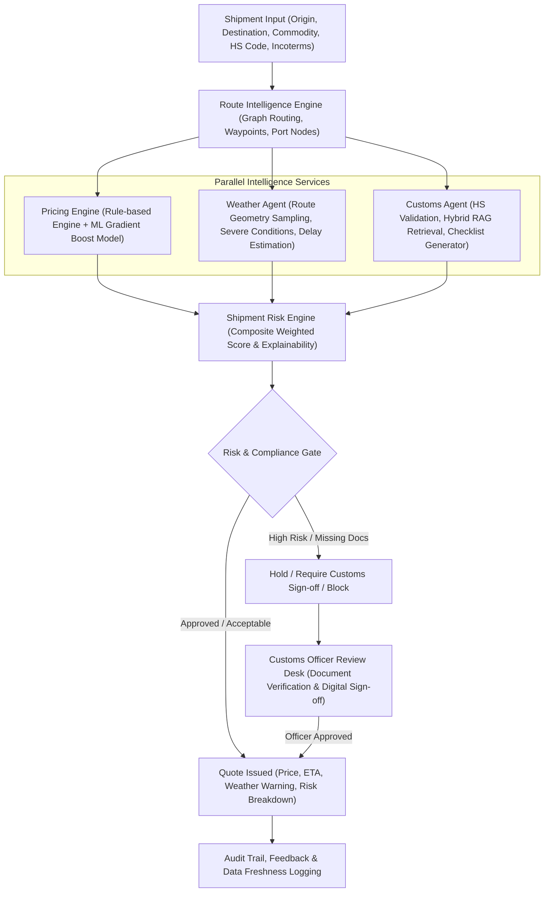

# Milestone 3: Master End-to-End Implementation Plan
## AI Intelligent Freight Quote Generation System

---

## 1. Executive Summary & Objective

**Milestone 3 (M3)** transforms the Freight Quote Generation System from a standard routing and rule-based pricing calculator into an **AI-driven Intelligence & Compliance Orchestrator**. 

In M3, quotes are no longer isolated calculations. Instead, **Weather Risk**, **Customs Compliance (with RAG)**, **Multi-Factor Shipment Risk Scoring**, and **ML Freight Pricing Prediction** operate concurrently to evaluate viability, verify regulatory requirements, predict delays, and protect cargo profit margins before final quote issuance.

---

## 2. Milestone 3 Architecture & Project Flow



---

## 3. The 6-Phase Execution Roadmap

```
milestone_3_docs/
├── 00_master_milestone_3_implementation_plan.md
├── 01_phase_1_database_and_contracts_plan.md
├── 02_phase_2_weather_intelligence_plan.md
├── 03_phase_3_customs_rag_intelligence_plan.md
├── 04_phase_4_shipment_risk_engine_plan.md
├── 05_phase_5_ml_pricing_deliverable_plan.md
├── 06_phase_6_testing_delivery_and_documentation_plan.md
├── 07_phase_1_completion_and_architecture_review.md
├── 08_phase_2_completion_and_architecture_review.md
├── 09_phase_3_completion_and_architecture_review.md
├── 10_phase_4_completion_and_architecture_review.md
├── 11_phase_5_completion_and_architecture_review.md
└── 12_phase_6_completion_and_architecture_review.md
```

### Phase Breakdown Summary:

1. **Phase 1: Database Models, Schemas & API Contracts**
   - Establishes all relational schemas, audit fields, JSON schemas, serializers, and REST API contracts for Weather, Customs, Risk, ML Pricing, and Documents.
2. **Phase 2: Weather Intelligence Agent & Visual Panels**
   - Implements route geometry sampling, Open-Meteo/NOAA provider adapters with caching and fallback, weather risk calculation, delay probability estimation, storm alerts, and the Weather Risk interactive UI.
3. **Phase 3: Customs Intelligence & Hybrid RAG System**
   - Implements regulation document ingestion, semantic chunking, TF-IDF + Vector hybrid retrieval with reranking, HS code validation, document checklists, document upload, and the Customs Officer Sign-off workflow.
4. **Phase 4: Multi-Factor Shipment Risk Engine & Policy Gating**
   - Implements composite risk scoring ($W: 30\%, C: 25\%, R: 20\%, P: 15\%, Cargo: 10\%$), factor-level SHAP-like explainability, automated risk alerts, state-machine quote blocking, and the Risk Dashboard.
5. **Phase 5: Machine Learning Pricing Model & Benchmarking**
   - Implements feature engineering pipeline, regression model training (LightGBM/XGBoost/RandomForest vs Linear Baseline), model evaluation metrics (MAE, RMSE, $R^2$), artifact persistence, real-time prediction endpoint, and the Rule-vs-ML pricing comparison screen.
6. **Phase 6: Comprehensive Testing, Documentation & Final Delivery**
   - Implements 50 curated customs test scenarios, weather coverage tests, E2E quote workflow integration tests, data freshness monitoring, and packages all 13 architecture specification documents.

---

## 4. Milestone 3 Definition of Done (DoD) Checklist

- [x] Weather Agent samples route coordinates and calculates weather risk and delay probabilities.
- [x] Weather observations and severe storm alerts are cached and stored with provider timestamps.
- [x] Customs Agent validates HS codes and extracts regulatory rules with legal citations.
- [x] Hybrid RAG retrieval (BM25/Keyword + Vector Embeddings) successfully answers trade requirements.
- [x] Customs document checklist is automatically produced for shipment routes and commodities.
- [x] Document upload and customs officer digital approval/rejection gates quote issuance.
- [x] Composite Risk Engine calculates explainable 0–100 risk scores across 5 dimensions.
- [x] ML pricing model is trained, evaluated ($R^2 > 0.85$, minimized MAE/RMSE), and benchmarked against rule-based calculations.
- [x] Frontend panels for Weather, Customs, Risk, and ML vs. Rule comparison are integrated and responsive.
- [x] 50 curated customs verification test cases and all unit/integration tests pass with full logs.
- [x] All 13 M3 architectural specification and review documents are generated.
