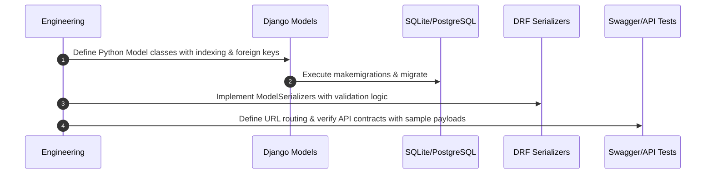

# Phase 1: Database Models, Schemas & API Contracts Implementation Plan

---

## 1. Phase Objective & Overview
Phase 1 designs and implements the core data schema, relational persistence layers, model migrations, serialization contracts, and REST API interfaces required by all Milestone 3 intelligence subsystems (Weather, Customs, Risk, ML Pricing, and Document Management).

---

## 2. Detailed Technical Scope

### 2.1 Database Models to Create
1. **`WeatherAssessment`**: Stores composite weather risk evaluation for a shipment route, risk scores, delay probabilities, provider info, and expiry.
2. **`WeatherObservation`**: Point-by-point telemetry along route waypoints (wind speed, direction, wave height, precipitation, pressure, storm alerts).
3. **`WeatherAlert`**: Severe weather warnings (cyclones, typhoons, gales) geo-tagged along maritime/road corridors.
4. **`CustomsRequirement`**: Harmonized rules per origin/destination country pair, commodity class, HS code, and Incoterm.
5. **`CustomsDocumentRequirement`**: Mandatory vs. optional paperwork (e.g., Certificate of Origin, Phyto-sanitary, MSDS).
6. **`CustomsComplianceCheck`**: Real-time evaluation results, compliance readiness score, status (`APPROVED`, `NEEDS_DOCUMENTS`, `REJECTED`, `PENDING_REVIEW`).
7. **`CustomsChecklistItem`**: Itemized actionable requirement checklist with evidence attachments and legal citations.
8. **`RegulationDocument` & `RegulationChunk`**: Raw and chunked trade legislation text with embeddings for vector search.
9. **`HSCodeReference`**: 6-to-10 digit HS code lookup table with prohibition/restriction flags.
10. **`ShipmentRiskAssessment` & `RiskFactor`**: Explainable composite risk record, multi-factor weights ($W, C, R, P, \text{Cargo}$), and individual factor contributions.
11. **`RiskAlert`**: Actionable risk events with status and user acknowledgments.
12. **`ShipmentDocument`**: File metadata, storage references, verification status, and audit metadata.
13. **`DataFreshness` & `IntegrationSyncLog`**: Real-time monitoring of external API availability, data age, and sync health.
14. **`AlertSubscription`**: User alerting preferences across email, Slack, and in-app feeds.

### 2.2 API Contract Design
- `POST /api/v1/weather/assess/`
- `POST /api/v1/customs/validate/`
- `POST /api/v1/regulations/search/`
- `GET /api/v1/risk/<shipment_id>/`
- `POST /api/v1/risk/assess/`
- `POST /api/v1/customs/<check_id>/sign-off/`
- `GET /api/v1/alerts/` & `POST /api/v1/alerts/<id>/acknowledge/`

---

## 3. Step-by-Step Execution Plan

1. Create Django applications or modular directories for `weather`, `customs`, `risk`, and `integrations`.
2. Implement model classes with strict field typing, indices on lookup keys (`shipment_id`, `hs_code`, `route_id`), and audit timestamps.
3. Generate and verify database migrations.
4. Build DRF serializers with explicit validation logic for ISO country codes, HS code formats, and score limits (0–100).
5. Register API routes and write initial unit tests verifying schema integrity.
