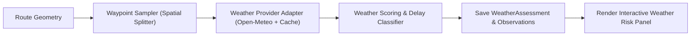

# Phase 2: Weather Intelligence Agent Implementation Plan

---

## 1. Phase Objective & Overview
Phase 2 builds the **Weather Intelligence Agent**. The agent intercepts candidate shipment routes, extracts intermediate geographic waypoints along maritime/land trajectories, pulls meteorological and oceanic forecasts, identifies extreme weather anomalies (cyclones, gale-force winds, high swell waves), and predicts shipment delay probabilities.

---

## 2. Detailed Technical Scope

### 2.1 Route Geometry Sampling
- Ingest polyline coordinates/waypoints of the maritime and multimodal routes.
- Equidistant spatial sampling algorithm: samples $N$ representative coordinates every $250\text{ km}$ to $500\text{ km}$ along international sea lanes (e.g., Malacca Strait, Suez Canal, Bab-el-Mandeb, Bay of Bengal).

### 2.2 Meteorological & Oceanographic Data Ingestion
- **Primary Provider**: Open-Meteo Marine & Weather API (free tier, global coverage, wind, wave height, swell period, surface pressure).
- **Secondary Provider / Fallback**: NOAA / GFS Marine forecast fallback simulator.
- Resilience: In-memory/Redis or SQLite database caching with 6-hour TTL (`expires_at`) to eliminate redundant third-party API calls.

### 2.3 Weather Risk Scoring & Delay Modeling
- Multi-factor meteorological scoring:
  $$\text{Score}_{\text{weather}} = \alpha \cdot \text{WindScore} + \beta \cdot \text{WaveScore} + \gamma \cdot \text{PrecipScore} + \delta \cdot \text{StormScore}$$
- Delay probability estimation based on Beaufort scale thresholds:
  - Wave height $> 4.0\text{ m}$ or Wind $> 35\text{ knots}$ $\rightarrow$ High delay probability ($> 60\%$).
  - Storm detection $\rightarrow$ Generates `WeatherAlert` and suggests route re-routing or departure window delay.

### 2.4 Interactive Weather UI Panel
- Interactive route map showing waypoint weather markers, animated wind/wave status, severity badges, and weather risk breakdown cards.

---

## 3. Step-by-Step Execution Plan

1. Implement `RouteGeometrySampler` utility class.
2. Build `WeatherProviderAdapter` with retry policies and mock fixtures for offline testing.
3. Construct `WeatherRiskScorer` and `DelayProbabilityEstimator`.
4. Create the `POST /api/v1/weather/assess/` endpoint.
5. Build the React `WeatherRiskPanel` frontend component with live visual indicators.
