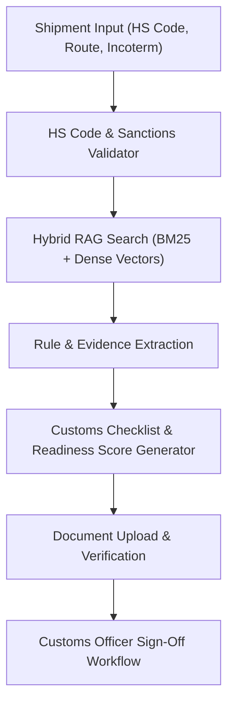

# Phase 3: Customs Intelligence & Hybrid RAG System Implementation Plan

---

## 1. Phase Objective & Overview
Phase 3 builds the **Customs Intelligence & RAG System**. It automates cross-border trade compliance by parsing Origin/Destination trade agreements, validating Harmonized System (HS) codes, executing hybrid vector + keyword search over international trade regulations, generating mandatory document checklists, and offering a digital sign-off portal for customs officers.

---

## 2. Detailed Technical Scope

### 2.1 HS Code Validation & Commodity Verification
- Full validation of 6-digit WCO HS Codes and extended 8/10-digit national tariff lines.
- Flagging of hazardous materials (DG classes 1-9), dual-use items, embargoes, and prohibited/sanctioned goods.

### 2.2 Regulation Ingestion & Hybrid RAG Retrieval
- **Corpus**: Trade regulations, tariff schedules, import requirements for EU (TARIC), US (HTS/CBP), India (CBIC), Singapore, UAE, China.
- **Chunking Pipeline**: Semantic section-aware splitting (300–500 tokens per chunk with metadata: country, authority, chapter).
- **Hybrid Retrieval**:
  - Sparse / Keyword search: BM25 / PostgreSQL Full-Text / TF-IDF for exact legal terminology and HS code matches.
  - Dense / Semantic search: Vector embeddings (e.g. `sentence-transformers/all-MiniLM-L6-v2` or lightweight dense representations).
  - Reciprocal Rank Fusion (RRF) / Reranking layer to select the top-k highest-confidence legal citations.

### 2.3 Document Checklist & Compliance Readiness
- Dynamically derives mandatory documents based on:
  - Commodity type (e.g., MSDS for chemicals, Phytosanitary for perishables, Form A / COO for preferential tariffs).
  - Incoterms (e.g., DDP requires buyer import clearance authority).
- Computes `readiness_score` (0% to 100%) and categorizes status into `APPROVED`, `NEEDS_DOCUMENTS`, `NEEDS_REVIEW`, or `REJECTED`.

### 2.4 Document Upload & Customs Officer Sign-off Portal
- Enables document upload against checklist requirements.
- Customs Officer review desk with digital approval, conditional approval, or rejection with mandatory feedback reasons.

---

## 3. Step-by-Step Execution Plan

1. Seed regulatory database with foundational trade legislation and tariff rules.
2. Build the semantic chunking and embedding generation indexing pipeline.
3. Implement hybrid search engine with citation linking.
4. Implement `POST /api/v1/customs/validate/` and `POST /api/v1/customs/<check_id>/sign-off/`.
5. Develop React components: `CustomsComplianceCard`, `DocumentUploadModal`, and `CustomsOfficerDesk`.
