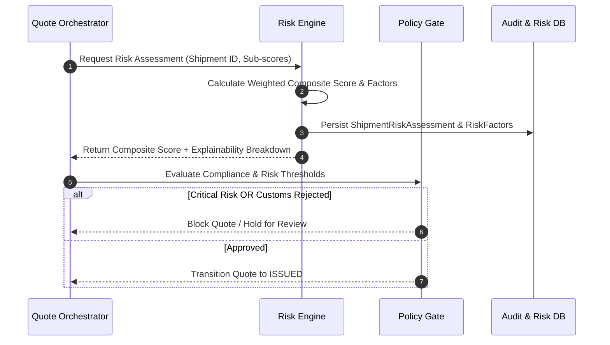

# Phase 4: Multi-Factor Shipment Risk Engine & Policy Gating Plan

---

## 1. Phase Objective & Overview
Phase 4 implements the **Shipment Risk Engine** and **Quote State Machine Integration**. It synthesizes independent signals from Weather, Customs, Route Graph, Port Congestion, and Cargo sensitivity into an explainable 0–100 composite risk score, automatically gating quote issuance based on policy rules.

---

## 2. Detailed Technical Scope

### 2.1 Multi-Factor Composite Scoring Formula
The overall shipment risk score is computed through a calibrated, configurable weighting model:

$$\text{OverallScore} = (W \cdot 0.30) + (C \cdot 0.25) + (R \cdot 0.20) + (P \cdot 0.15) + (\text{Cargo} \cdot 0.10)$$

Where:
- $W$ = Weather Risk Score ($0 - 100$)
- $C$ = Customs Risk Score ($100 - \text{ReadinessScore}$)
- $R$ = Route Graph Risk Score (piracy zones, geopolitics, chokepoint transit complexity)
- $P$ = Port & Chokepoint Congestion Score (berth wait times, strikes, canal bottlenecks)
- $\text{Cargo}$ = Cargo Risk Score (hazardous classes, high-value, fragile, temperature-controlled)

### 2.2 Risk Severity Tiers & Threshold Actions
- **0 – 30 (LOW)**: Auto-approved; standard quote issuance.
- **31 – 60 (MEDIUM)**: Approved with cautionary advisory notes in quote document.
- **61 – 80 (HIGH)**: Flagged; requires Senior Freight Agent review or customer waiver.
- **81 – 100 (CRITICAL)**: Hard blocked from automatic quote generation.

### 2.3 Explainability Framework
- Deconstructs the composite score into discrete `RiskFactor` records.
- For each factor, logs: `factor_type`, `score`, `weight`, `contribution` (percentage points), `severity`, and plain-English `reason`.

### 2.4 State Machine Quote Gating
- Updates quote workflow:
  `Draft` $\rightarrow$ `Route Evaluated` $\rightarrow$ `Priced` $\rightarrow$ `Weather Assessed` $\rightarrow$ `Customs Assessed` $\rightarrow$ `Risk Assessed` $\rightarrow$ `Compliance Check Gate` $\rightarrow$ `Quote Issued` or `Quote Blocked`.

---

## 3. Step-by-Step Execution Plan

1. Create `RiskScoringEngine` domain service with customizable weights and rules.
2. Implement factor-level explainability generator.
3. Integrate risk evaluation into the Quote state machine in Django.
4. Implement `POST /api/v1/risk/assess/` and `GET /api/v1/risk/<shipment_id>/`.
5. Build the React `RiskDashboard` and `ExplainabilityCard` frontend modules.
