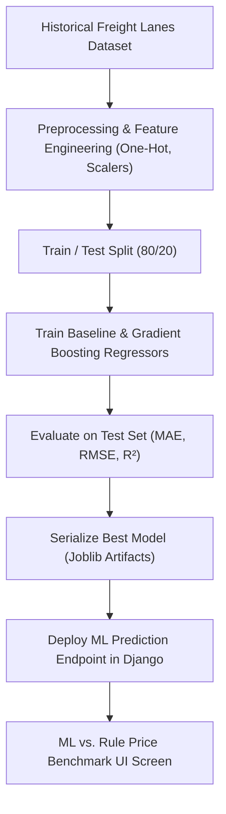

# Phase 5: Machine Learning Pricing Model & Benchmarking Plan

---

## 1. Phase Objective & Overview
Phase 5 develops a **Machine Learning Freight Pricing Model** to predict market-driven container and multimodal freight rates from historical trade lane data, and benchmarks it directly against the existing rule-based cost-plus formula.

---

## 2. Detailed Technical Scope

### 2.1 Dataset Preparation & Synthetic Historical Corpus
- Features:
  - `origin_port`, `destination_port`, `distance_km`, `transit_time_days`
  - `cargo_type` (Dry, Reefer, Hazardous, Oversized), `weight_kg`, `volume_cbm`
  - `container_type` (20ft, 40ft, 40ft HC, LCL)
  - `departure_month`, `seasonality_index`, `brent_crude_fuel_index`
  - `market_demand_factor`, `carrier_tier`
- Target: `actual_freight_price_usd`

### 2.2 Model Architecture & Training Pipeline
- **Baseline Models**: Ordinary Least Squares (OLS) Linear Regression, Ridge/Lasso.
- **Candidate Models**: Random Forest Regressor, Gradient Boosting (XGBoost / LightGBM), Multi-Layer Perceptron (MLP).
- **Cross-Validation & Hyperparameter Tuning**: 5-Fold Stratified Cross-Validation on trade lanes, Grid/Random Search for depth, learning rate, and estimator counts.

### 2.3 Evaluation Metrics & Acceptance Criteria
- Mean Absolute Error ($\text{MAE} \le \$150$)
- Root Mean Squared Error ($\text{RMSE} \le \$220$)
- Coefficient of Determination ($R^2 \ge 0.88$)
- Zero data leakage verification between train and test splits.

### 2.4 ML vs. Rule-Based Price Comparison & Prediction API
- Model artifact export (`model.joblib`, `preprocessor.joblib`).
- Prediction endpoint `POST /api/v1/pricing/ml-predict/`.
- Interactive comparison dashboard displaying Rule Price, ML Price, Variance ($\Delta\%$), Confidence Interval, and Pricing Strategy Recommendation.

---

## 3. Step-by-Step Execution Plan

1. Construct clean historical shipment dataset in `ml/data/`.
2. Implement feature engineering and preprocessing pipeline in `ml/src/`.
3. Train and benchmark regression models, recording metric logs in `ml/reports/`.
4. Package selected production model artifacts into `ml/models/`.
5. Implement Django ML inference service with fallback to rule engine.
6. Build React `MLvsRulePricingComparison` component for internal sales and pricing analysts.
