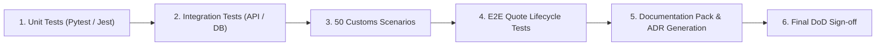

# Phase 6: Comprehensive Testing, Documentation & Final Delivery Plan

---

## 1. Phase Objective & Overview
Phase 6 validates the end-to-end reliability, accuracy, regulatory rigor, and performance of the combined Milestone 3 solution. It executes unit tests, integration tests, 50 curated customs scenarios, weather coverage tests, and generates the complete suite of technical documentation.

---

## 2. Detailed Technical Scope

### 2.1 Functional & Domain Validation Suites
- **Customs Scenario Benchmark**: 50 curated trade lane test cases (hazardous chemicals, perishables, electronics, textiles, machinery across USA, EU, India, China, UAE, UK) with target accuracy $\ge 90\%$.
- **Weather Risk & Delay Tests**: Validates maritime corridors under clear, storm, and gale conditions with 100% weather assessment coverage on active routes.
- **Explainability Verification**: Tests that every risk calculation produces non-empty, actionable factor explanations.
- **Quote State Machine Gating**: Tests that quotes cannot transition to `ISSUED` status if customs sign-off is pending or risk is critical.

### 2.2 Integration & Resiliency Testing
- External API timeouts and mock fallbacks (Open-Meteo offline fallback).
- Database transaction rollback tests on document upload failures.
- Data Freshness monitoring tests verifying sync timestamps.

### 2.3 Documentation Package Deliverables
Must generate all required Milestone 3 architectural documents:
1. `M3_Requirements.md`
2. `M3_Architecture.md`
3. `M3_Database_Design.md`
4. `M3_API_Documentation.md`
5. `Weather_Agent_Design.md`
6. `Customs_Agent_Design.md`
7. `Shipment_Risk_Scoring.md`
8. `RAG_Design.md`
9. `ML_Model_Evaluation.md`
10. `Dataset_Documentation.md`
11. `M3_Test_Plan.md`
12. `M3_Test_Results.md`
13. `M3_Definition_of_Done.md`
14. `ADRs/` (Architectural Decision Records)

---

## 3. Step-by-Step Execution Plan

1. Author pytest test cases for Weather, Customs, Risk, and ML endpoints.
2. Construct and run the 50-case automated customs verification benchmark script.
3. Validate data freshness and background integration sync logging.
4. Generate all 13 required Markdown architecture reports and ADRs.
5. Perform end-to-end acceptance demo dry run and finalize M3 delivery report.
