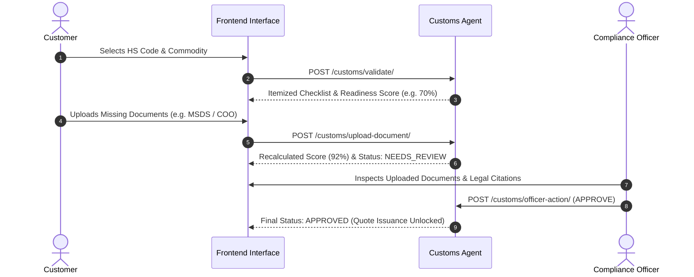

# Customs Agent & Compliance Workflow Specification

---

## 1. Agent Objective
The Customs Compliance Agent acts as an autonomous digital customs broker. It validates HS tariff classifications, retrieves relevant international trade regulations, constructs cited document checklists, and manages a two-tier verification process for freight quotations.

---

## 2. Regulatory Knowledge Corpus & Seeding
The agent maintains an indexed legal repository covering:
1. **World Customs Organization (WCO)**: Harmonized Commodity Description and Coding System (HS 2022).
2. **European Union (EU)**: Union Customs Code (UCC Reg 952/2013) & Dual-Use Regulation (EU 2021/821).
3. **United States (US)**: US Customs and Border Protection (CBP) Regulations, Export Administration Regulations (EAR), ITAR Munitions list.
4. **India**: Central Board of Indirect Taxes and Customs (CBIC) Circulars and DGFT Import Policy.
5. **UAE & Gulf**: Federal Customs Authority GCC Common Customs Law.

---

## 3. Two-Tier Verification & Approval Workflow

---

## 4. Prohibited Cargo & Sanctions Hard-Blocking
- Commodities classified under **HS 930200** (Revolvers, Pistols, Munitions) or sanctioned dual-use items trigger:
  - `is_prohibited = True`
  - `readiness_score = 0.0%`
  - `status = "REJECTED"`
  - `policy_action = "BLOCK_QUOTE_ISSUANCE"`
- Hard-blocks bypass manual officer overrides to ensure zero export compliance breaches.
