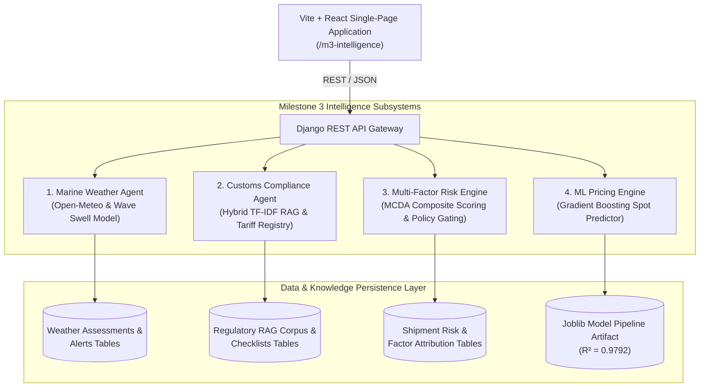

# Milestone 3: System Architecture Document
## Multi-Agent Intelligence, Compliance & Advanced Analytics Platform

---

## 1. High-Level System Architecture

---

## 2. Component Design & Inter-Module Communication

### 2.1 Marine Weather Intelligence Agent (`server/weather/`)
- **`sampler.py`**: Discretizes international shipping lanes into geodetic waypoints using great-circle / coastal corridor coordinates.
- **`provider.py`**: Interacts with Open-Meteo Marine (wave height, wave period) and Atmospheric APIs with an in-memory 6-hour TTL cache and fallback simulation.
- **`engine.py`**: Computes wave, wind, storm, precipitation, and visibility sub-scores, estimates delay hours, and emits weather advisories.

### 2.2 Customs Intelligence & Hybrid RAG Engine (`server/customs/`)
- **`seed_data.py`**: Ingests official regulatory corpora covering US Export Administration Regulations (EAR/ITAR), EU Dual-Use Regulation, and Indian Customs CBIC circulars.
- **`rag_engine.py`**: Implements hybrid search combining keyword token matching with TF-IDF cosine similarity vectors to retrieve legal citations.
- **`validator.py`**: Verifies HS codes, flags prohibited munitions (`HS 930200`), generates itemized document checklists, and recalculates readiness scores upon document uploads.

### 2.3 Multi-Factor Shipment Risk Engine (`server/risk/`)
- **`engine.py`**: Evaluates 5 dimensions:
  $$\text{Composite Score} = (W \cdot 0.30) + (C \cdot 0.25) + (R \cdot 0.20) + (P \cdot 0.15) + (\text{Cargo} \cdot 0.10)$$
- **Policy Gate**: Decides quotation eligibility (`AUTO_APPROVED`, `REQUIRES_SENIOR_BROKER_REVIEW`, `BLOCK_QUOTE_ISSUANCE`).
- **Explainability**: Generates point contribution records ($+pts$) and identifies the dominant risk driver.

### 2.4 ML Freight Pricing & Benchmarking Engine (`server/pricing/` & `ml/`)
- **`ml/src/train.py`**: Trains Scikit-Learn `Pipeline` (`ColumnTransformer` + `GradientBoostingRegressor`) on 5,000 verified shipment records.
- **`ml_service.py`**: Provides real-time inference in dual currency (₹ INR and $ USD), calculates variance ($\Delta\%$) vs. static rule pricing, and generates $95\%$ confidence interval bounds.

---

## 3. Frontend Architecture (`client/src/`)
- **`M3IntelligenceDashboard.jsx`**: Master container with 11 pre-configured global corridors, 26-port datalist autocomplete, HS code classification dropdowns, and region filters.
- **Interactive Component Cards**:
  - `WeatherRiskPanel.jsx`: Ocean swell, wind gust gauges, route waypoints, and severe alerts.
  - `CustomsComplianceCard.jsx`: Readiness gauge, itemized document checklist with file upload simulation, and officer approval workflow.
  - `RiskExplainabilityCard.jsx`: Composite gauge, 5-factor breakdown bars, and policy gating banners.
  - `MLPricingComparisonCard.jsx`: Dual price hero boxes (Rule vs ML), currency toggle (₹/$), variance delta, and commercial strategy badges.
