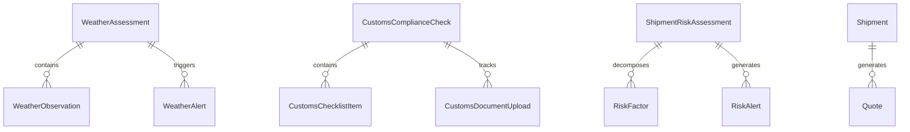

# Milestone 3: Database Design & Data Dictionary

---

## 1. Entity Relationship Overview

Milestone 3 models are organized across 3 Django apps (`weather`, `customs`, `risk`) plus mentor integration tables (`quotes`):

---

## 2. Table Specifications & Data Dictionaries

### 2.1 Weather Subsystem (`server/weather/models.py`)

#### Table: `weather_assessments`
| Column | Type | Nullable | Description |
|---|---|---|---|
| `id` | UUID | No (PK) | Unique assessment identifier |
| `shipment_id` | Char(128) | No (Index) | Associated shipment reference |
| `route_id` | Char(128) | Yes | Evaluated route identifier |
| `origin` | Char(128) | No | Origin port/city |
| `destination` | Char(128) | No | Destination port/city |
| `overall_score` | Float | No | Composite weather score ($0-100$) |
| `wave_risk` | Float | No | Ocean swell risk component ($0-100$) |
| `wind_risk` | Float | No | Wind gust risk component ($0-100$) |
| `delay_probability`| Float | No | Delay probability ($0.0-1.0$) |
| `estimated_delay_hours` | Float | No | Forecasted transit delay in hours |
| `has_storm` | Boolean | No | True if storm detected on any waypoint |
| `advisories` | JSONField | No | Departure and rerouting advisories |
| `assessed_at` | DateTime | No | Assessment generation timestamp |

#### Table: `weather_observations`
| Column | Type | Nullable | Description |
|---|---|---|---|
| `id` | UUID | No (PK) | Observation identifier |
| `assessment_id` | FK | No | Foreign Key to `weather_assessments` |
| `waypoint_name` | Char(128) | No | Named marine waypoint / hub |
| `latitude` | Float | No | Geodetic latitude |
| `longitude` | Float | No | Geodetic longitude |
| `wave_height` | Float | No | Significant wave height in meters |
| `wind_speed` | Float | No | Wind velocity in knots |
| `visibility` | Float | No | Horizontal visibility in km |
| `pressure` | Float | No | Atmospheric pressure in hPa |
| `storm_detected` | Boolean | No | True if cyclonic / storm conditions |

---

### 2.2 Customs Subsystem (`server/customs/models.py`)

#### Table: `customs_compliance_checks`
| Column | Type | Nullable | Description |
|---|---|---|---|
| `id` | UUID | No (PK) | Compliance check record ID |
| `shipment_id` | Char(128) | No (Index) | Associated shipment identifier |
| `origin_country`| Char(128) | No | Country of export |
| `destination_country` | Char(128) | No | Country of import |
| `hs_code` | Char(32) | No | 6-digit Harmonized System tariff code |
| `commodity` | Char(255) | No | Plain-English commercial cargo description |
| `incoterm` | Char(10) | No | Incoterm rule (e.g. CIF, FOB, DDP) |
| `readiness_score` | Float | No | Document completeness ($0-100\%$) |
| `status` | Char(32) | No | `APPROVED`, `NEEDS_REVIEW`, `REJECTED` |
| `is_prohibited` | Boolean | No | True if under embargo / munitions ban |
| `officer_name` | Char(128) | Yes | Sign-off customs compliance officer |
| `officer_notes` | TextField | Yes | Formal regulatory decision notes |

#### Table: `customs_checklist_items`
| Column | Type | Nullable | Description |
|---|---|---|---|
| `id` | UUID | No (PK) | Checklist item ID |
| `check_id` | FK | No | Foreign Key to `customs_compliance_checks` |
| `item_name` | Char(255) | No | Mandatory document title (e.g. COO, MSDS) |
| `status` | Char(32) | No | `PENDING`, `UPLOADED`, `VERIFIED`, `REJECTED` |
| `citation` | Char(255) | Yes | Legal regulatory article / law citation |
| `evidence` | TextField | Yes | Grounding snippet from RAG corpus |

---

### 2.3 Risk Subsystem (`server/risk/models.py`)

#### Table: `shipment_risk_assessments`
| Column | Type | Nullable | Description |
|---|---|---|---|
| `id` | UUID | No (PK) | Risk assessment ID |
| `shipment_id` | Char(128) | No (Index) | Associated shipment reference |
| `weather_score`| Float | No | Weather risk score ($0-100$) |
| `customs_score`| Float | No | Customs risk score ($0-100$) |
| `route_score` | Float | No | Route corridor score ($0-100$) |
| `port_score` | Float | No | Port congestion score ($0-100$) |
| `cargo_score` | Float | No | Cargo sensitivity score ($0-100$) |
| `overall_score`| Float | No | Composite weighted score ($0-100$) |
| `risk_level` | Char(20) | No | `LOW`, `MEDIUM`, `HIGH`, `CRITICAL` |
| `explanation` | JSONField | No | Dominant driver, weights, and policy action |

#### Table: `risk_factors`
| Column | Type | Nullable | Description |
|---|---|---|---|
| `id` | UUID | No (PK) | Factor attribution ID |
| `risk_assessment_id` | FK | No | Foreign Key to `shipment_risk_assessments` |
| `factor_type` | Char(32) | No | `WEATHER`, `CUSTOMS`, `ROUTE`, `PORT`, `CARGO` |
| `factor_name` | Char(128) | No | Human-readable factor dimension name |
| `score` | Float | No | Raw dimension score ($0-100$) |
| `weight` | Float | No | Configured mathematical weight ($0.10 - 0.30$) |
| `contribution` | Float | No | Points contributed ($+pts$) to overall score |
| `severity` | Char(20) | No | `LOW`, `MEDIUM`, `HIGH`, `CRITICAL` |
| `reason` | TextField | No | Plain-English root cause explanation |
