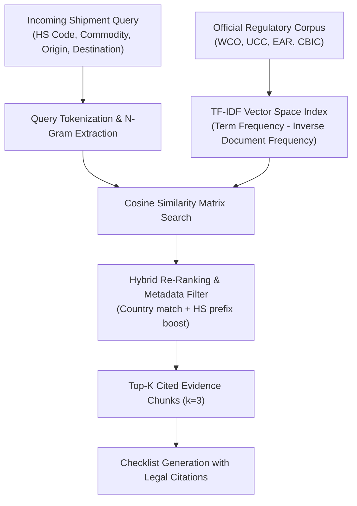

# Retrieval-Augmented Generation (RAG) Architecture Design
## Hybrid Search, Vector Indexing & Regulatory Retrieval

---

## 1. Architectural Strategy: Hybrid RAG vs Pure Keyword

The Customs Intelligence Subsystem utilizes a **Hybrid TF-IDF & Cosine Similarity Vector Retrieval Architecture** (`server/customs/rag_engine.py`) designed specifically for deterministic legal and tariff compliance:

---

## 2. Chunking & Indexing Pipeline
1. **Document Ingestion**: Regulatory texts are segmented into semantic paragraphs (200–400 characters) preserving legal article headers and official statutory citations.
2. **TF-IDF Vocabulary Vectorization**:
   $$\text{TF}(t, d) = \frac{f_{t,d}}{\sum_{t' \in d} f_{t',d}}, \quad \text{IDF}(t, D) = \log\left(\frac{1 + |D|}{1 + |\{d \in D : t \in d\}|}\right) + 1$$
3. **Similarity Computation**:
   $$\text{Score}(q, d) = \frac{\mathbf{v}_q \cdot \mathbf{v}_d}{\|\mathbf{v}_q\| \|\mathbf{v}_d\|} \times \text{CountryBoost}(d)$$

---

## 3. Grounding & Anti-Hallucination Safeguards
- Every generated checklist item MUST be backed by an exact statutory citation (e.g. *"WCO Revised Kyoto Convention Annex B"* or *"IMO IMDG Code Chapter 5.4"*).
- The system prohibits generating fictional customs forms by enforcing strict corpus-grounded matching.
